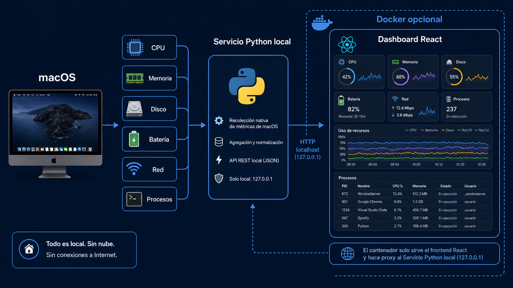

<div align="center">

# mac-system-dashboard

**Un dashboard local y bajo demanda para entender el estado de tu Mac.**

CPU, memoria, disco, batería y procesos reales, reunidos en una interfaz web clara que no envía datos fuera del ordenador.

[](https://www.apple.com/macos/)
[](https://www.python.org/)
[](https://react.dev/)
[](https://www.docker.com/)
[](#-qué-verás)
[](https://github.com/Ju4nC4r/Mac-System-Dashboard/commits/main)

[Inicio rápido](#-inicio-rápido) · [Docker](#-usar-docker) · [API](#-api-local) · [Seguridad](#-seguridad) · [Contribuir](#-contribuir)

</div>

## ✨ Introducción

`mac-system-dashboard` convierte las métricas esenciales de macOS en un panel web local: tarjetas grandes para una lectura inmediata, gráficas para detectar tendencias y una tabla de procesos para investigar qué está consumiendo recursos.

Está pensado para ejecutarse cuando lo necesitas. El servicio escucha únicamente en el propio Mac y conserva las muestras solo en memoria mientras está en marcha.

## 🧭 Características

- **Lectura inmediata:** CPU, memoria, disco y batería en tarjetas grandes y actualizadas automáticamente.
- **Tendencias útiles:** gráficas recientes de CPU y memoria para entender la evolución, no solo una cifra puntual.
- **Procesos bajo control:** búsqueda y ordenación por consumo, compatible con formatos numéricos regionales de macOS, con cierre normal o forzado tras confirmación.
- **Seguro por defecto:** protege procesos esenciales de macOS y no intenta elevar permisos.
- **Privado y local:** no necesita base de datos, cuenta ni servicio en la nube.
- **Preparado para desarrollo:** React, TypeScript, Python, pruebas automatizadas y contenedor para la interfaz.

## 🚀 Inicio rápido

### Requisitos

- macOS.
- Python 3.10 o posterior.
- Node.js 20 o posterior y npm.

### 1. Preparar el proyecto

```bash
python3 -m venv .venv
source .venv/bin/activate

cd frontend
npm install
npm run build
cd ..
```

### 2. Arrancar el dashboard

```bash
.venv/bin/python backend/app.py
```

Abre en el navegador la dirección local indicada por la terminal. Para detenerlo, pulsa `Control + C`.

> El servicio no se inicia automáticamente al encender el Mac: se ejecuta solo bajo petición.

## 📊 Qué verás

| Área | Información disponible |
| --- | --- |
| **Resumen** | Uso de CPU, memoria, disco y batería. |
| **Gráficas** | Evolución reciente de CPU y memoria. |
| **Procesos** | Nombre, PID, CPU, memoria y estado de los procesos más activos. |
| **Acciones** | Finalización normal o forzada de un proceso seleccionado, con confirmación. |

La disponibilidad de batería depende del hardware. En un Mac sin batería, el dashboard lo muestra explícitamente en lugar de inventar un valor. Las gráficas se van completando mientras el servicio está en marcha: espera unos segundos después de iniciarlo para ver la tendencia.

## 🛠️ Desarrollo

## 🗺️ Arquitectura



La interfaz usa React, TypeScript y Vite. Para desarrollarla con recarga automática, arranca primero el servicio Python y, en otra terminal, ejecuta:

```bash
cd frontend
npm run dev
```

Vite reenvía las solicitudes de API al servicio local de macOS.

### Estructura del proyecto

```text
frontend/        React + TypeScript + Vite
  src/           Interfaz, gráficas, estado y estilos
backend/         Servicio local de Python
  app.py         Métricas de macOS, API y control seguro de procesos
backend/static/  Salida compilada de la interfaz
docs/assets/     Infografías y recursos de documentación
.github/         Automatización de comprobaciones en GitHub
AGENTS.md        Contexto operativo para asistentes
CONTRIBUTING.md  Guía para contribuciones
```

El backend obtiene las métricas con herramientas nativas de macOS: `sysctl`, `vm_stat`, `pmset` y `ps`. Para que la tabla de procesos funcione igual con cualquier idioma del sistema, normaliza los valores numéricos de `ps` a un formato estable antes de procesarlos.

## 📦 Usar Docker

El contenedor ejecuta la interfaz React y sus pruebas. El servicio Python debe mantenerse en macOS para poder consultar las métricas y procesos reales del host.

Con el servicio Python ya iniciado, levanta la interfaz contenida desde la raíz del proyecto:

```bash
docker compose up --build
```

La interfaz queda publicada en el puerto local `8080` y reenvía la API al servicio nativo del Mac. Para detenerla:

```bash
docker compose down
```

También puedes validar la fase de pruebas dentro de la imagen:

```bash
docker build --target test -t mac-system-dashboard-tests frontend
```

### Control de acceso

El contenedor admite protección con usuario y contraseña mediante autenticación básica. Copia el ejemplo y asigna una contraseña robusta que no vayas a incluir en Git:

```bash
cp .env.example .env
```

Edita `.env` y arranca o reconstruye el contenedor con `docker compose up --build`. A partir de ese momento el navegador pedirá las credenciales antes de mostrar el dashboard o sus rutas de API.

> Esta protección cubre el acceso publicado por Docker. El servicio Python se mantiene ligado a `localhost`, por lo que no queda expuesto a la red.

## 🔌 API local

Todas las rutas están disponibles solo desde el propio ordenador.

| Ruta | Descripción |
| --- | --- |
| `GET /api/overview` | Estado actual de CPU, memoria, disco y batería. |
| `GET /api/history` | Muestras recientes para las gráficas. |
| `GET /api/processes` | Procesos ordenados por consumo. |
| `POST /api/processes/:pid/terminate` | Solicita el cierre normal de un proceso. |
| `POST /api/processes/:pid/force` | Solicita el cierre forzado de un proceso. |

## 🔒 Seguridad

Finalizar un proceso puede causar pérdida de trabajo no guardado. La interfaz siempre pide confirmación y el backend bloquea acciones sobre procesos críticos conocidos, el proceso principal del sistema y el propio dashboard.

Algunos procesos pueden requerir permisos adicionales de macOS. El dashboard informa de esta limitación y nunca intenta obtener privilegios por su cuenta.

## ✅ Verificación

Antes de enviar cambios, ejecuta la batería completa:

```bash
cd frontend
npm test
npm run build
cd ..
.venv/bin/python -m py_compile backend/app.py
.venv/bin/python -m unittest discover -s backend -p 'test_*.py'
```

Las pruebas cubren cálculos de métricas, lectura y protección de procesos —incluidos formatos con coma decimal—, rutas de la API local, renderizado de la interfaz y búsqueda de procesos. La revisión visual se realiza con datos reales, sin finalizar aplicaciones durante las pruebas.

## 🤝 Contribuir

Las decisiones operativas y los ficheros clave del proyecto están documentados en [`AGENTS.md`](AGENTS.md). Mantén el dashboard local, seguro y compatible con macOS; no añadas telemetría ni automatices la finalización de procesos sin una petición explícita.

## 📄 Licencia

Copyright © 2026 Juan Carlos Gallego. Este proyecto se distribuye bajo la [GNU General Public License v3.0](LICENSE), sin una cláusula de versión posterior.

## 📚 Repositorio

El proyecto se mantiene en [GitHub](https://github.com/Ju4nC4r/Mac-System-Dashboard).
